---
---

# _Smart Invoice Maker for SMEs_

## A full-stack web application that helps small and medium-sized enterprises (SMEs) create, manage, and share invoices effortlessly.

## Features

- Client Management (Add/Edit/Delete Clients)
- Invoice Creation with Multiple Items
- Automatic Tax Calculation
- Download & Share Invoices via Email
- Responsive UI with Material UI
- REST API with Flask (Python) + SQLAlchemy
- React Frontend with Material UI Components
- Razorpay Payment Integration
- Ngrok used to expose backend to Razorpay Webhook

---

## Technologies Used

### Backend

- Python 3.10+
- Flask
- SQLAlchemy
- SQLite
- Flask-CORS
- Razorpay Python SDK
- Flask-Mail
- ngrok

### Frontend

- React
- Material UI
- Axios
- React Router

---

## Getting Started

### Prerequisites

- Python 3.10+
- Node.js (v16+)
- npm or yarn
- Git

---

## Backend Setup (Flask)

1. **Clone the repository**

   ```bash
   git clone https://github.com/mr-patiladitya/smart-invoice-maker.git
   cd smart-invoice-maker/backend
   ```

2. **Create a virtual environment**

   ```bash
   python -m venv venv
   source venv/Scripts/activate  # For Windows
   ```

3. **Install dependencies**

   ```bash
   pip install -r requirements.txt
   ```

4. **Run migrations (optional for SQLite)**

   If using Flask-Migrate for a production database:

   ```bash
   flask db init
   flask db migrate -m "Initial migration"
   flask db upgrade
   ```

5. **Start the backend server**

   ```bash
   flask run
   ```

   The backend API will be live at: `http://localhost:5000`

---

## Frontend Setup (React + Material UI)

1. **Navigate to the frontend directory**
   In another terminal:

   ```bash
   cd frontend
   ```

2. **Install dependencies**

   ```bash
   npm install
   ```

3. **Start the development server**

   ```bash
   npm start
   ```

   The frontend will be live at: `http://localhost:3000`

> ⚠️ Make sure the Flask backend is running at `http://localhost:5000`, as the frontend depends on it for API calls.

---

## Exposing Backend to Ngrok

- Go to this link: [Ngrok Setup for Windows](https://dashboard.ngrok.com/get-started/setup/windows) and sign up.
- Download `ngrok.zip`.
- Extract and open `ngrok.exe`. It will open a terminal.
- After signing up, you'll get an authtoken.
- Run this command to add the authtoken:

  ```bash
  ngrok config add-authtoken your-auth-token
  ```

- Run this command to expose the backend:

  ```bash
  ngrok http http://localhost:5000
  ```

- You will get a forwarding link like:

  ```
  Forwarding https://forwarding-link.ngrok-free.app
  ```

---

## Razorpay Webhook Integration

- Complete Razorpay sign-up and KYC in test mode.
- Go to [Razorpay Webhook Console](https://dashboard.razorpay.com/app/webhooks/).
- Create a new webhook.
- Enter the forwarding URL followed by `/api/razorpay/webhook`.

  ```
  webhook URL = https://forwarding-link.ngrok-free.app/api/razorpay/webhook
  ```

- Add the webhook secret to your `.env` file (optional).
- Set an admin email for alert notifications.
- Choose the following three `payment_link` events:

  - `payment_link.paid`
  - `payment_link.expired`
  - `payment_link.cancelled`

- Save the webhook.

---

## `.env` File Configuration

```env
MAIL_USERNAME="admin@gmail.com"
MAIL_PASSWORD="abcd abcd abcd abcd"  # 16-digit app password
RAZORPAY_KEY_ID="rzp_test_KEY"      # Provided after KYC
RAZORPAY_KEY_SECRET="KEY_SECRET"    # Provided after KYC
RAZORPAY_WEBHOOK_SECRET="WEBHOOK_SECRET"  # Must match the webhook
```

> ⚠️ **Important:** Restart the backend server every time you make changes to the `.env` file.

Reference link for `MAIL_PASSWORD`: [Sign in with App Passwords](https://support.google.com/accounts/answer/185833?hl=en)

---

## Project Structure

```
smart-invoice-maker/
│
├── backend/
│   ├── app.py                     # Main Flask app with config, Mail, Razorpay
│   ├── extensions.py              # DB, Mail, Razorpay client setup
│   ├── models.py                  # SQLAlchemy models (Client, Invoice, InvoiceItem)
│   ├── requirements.txt           # Python dependencies
│   ├── .env                       # Environment variables (Razorpay keys, Mail config)
│   ├── invoices.db                # SQLite DB (if used locally)
│   │
│   ├── migrations/                # Flask-Migrate files for DB schema
│   │   ├── versions/              # Auto-generated migration scripts
│   │   ├── alembic.ini
│   │   ├── env.py
│   │   └── script.py.mako
│   │
│   ├── routes/
│   │   ├── __init__.py
│   │   └── invoice_routes.py      # All invoice, client, upload, email, Razorpay APIs
│   │
│   ├── templates/
│   │   └── invoice_template.html  # Used by pdf_generator for invoice rendering
│   │
│   ├── utils/
│   │   ├── num_to_words.py        # Convert numbers to Indian currency words
│   │   └── pdf_generator.py       # Generates invoice PDF via pdfkit
│   │
│   ├── static/
│   │   └── uploads/               # Stores uploaded logos or signature images
│
├── frontend/
│   ├── public/
│   │   ├── favicon.ico
│   │   ├── index.html
│   │   └── manifest.json
│   │
│   ├── src/
│   │   ├── App.jsx                # Main app with React Router
│   │   ├── index.js               # React root entry
│   │   ├── index.css              # Global styles
│   │   ├── ThemeContext.jsx       # Light/Dark theme switcher
│   │   ├── utils/
│   │   │   └── trimCanvas.js      # Cleans up signature canvas
│   │   ├── components/            # Reusable components (Navbar, Steps, Preview)
│   │   └── pages/                 # Clients, Invoices, CreateInvoice, Home
│   │
│   ├── package.json
│   ├── package-lock.json
│   └── .gitignore
│
├── ngrok/                         # (External) Used to expose backend to internet
│   └── ngrok.exe                  # Run: ngrok http http://localhost:5000
│
├── razorpay/                      # (Integrated) Razorpay payment & webhook handling
│   ├── create-razorpay-order      # API to generate order ID
│   ├── create-payment-link        # API to send payment link
│   ├── razorpay/webhook           # Handles webhook event status update
│
└── README.md                      # Full documentation and setup guide
```

---

## 📸 Screenshots

Here are some screenshots of the Smart Invoice Maker:

### 🔧 Setup & Configuration

- **Ngrok Tunnel**  
  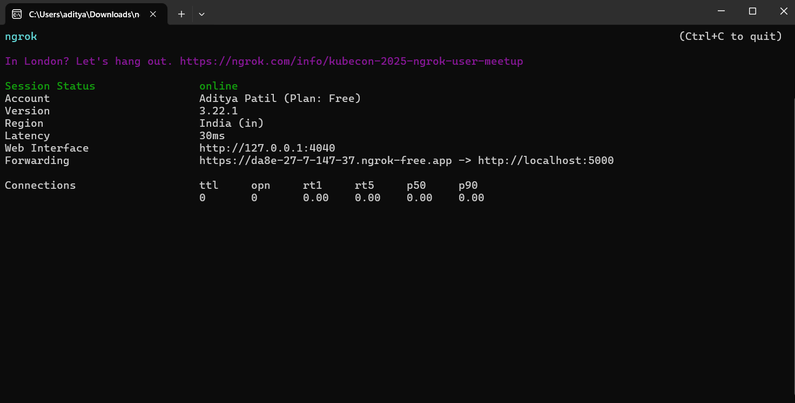
- **API Keys Input**  
  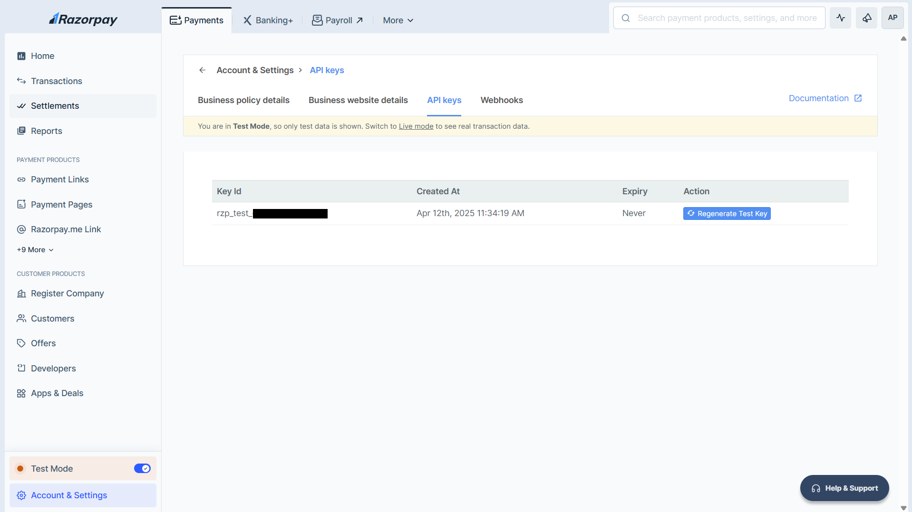
- **Webhook Configuration**  
  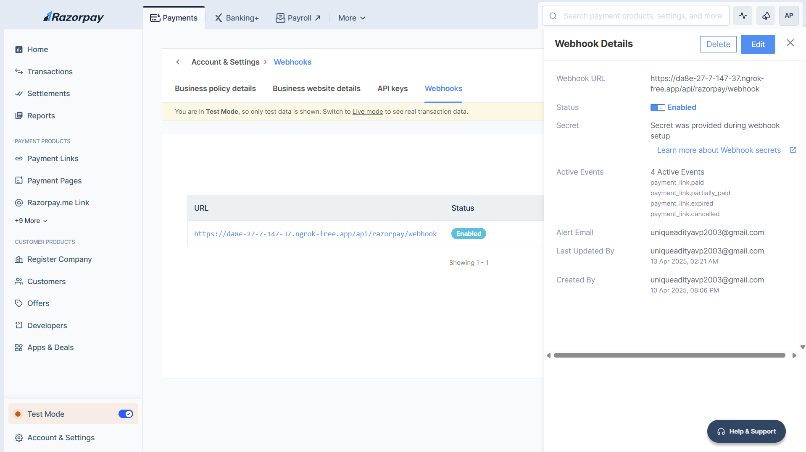

### 🌗 Homepage (Themes)

- **Light Mode**  
  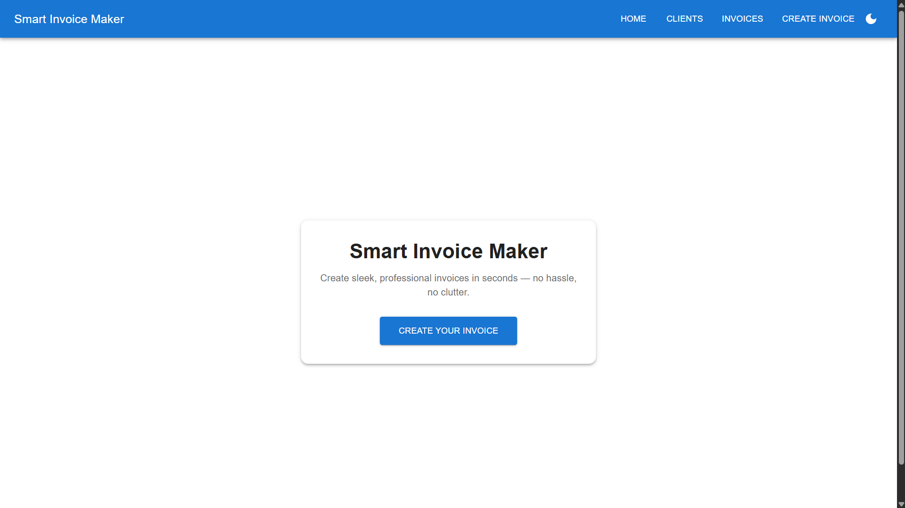
- **Dark Mode**  
  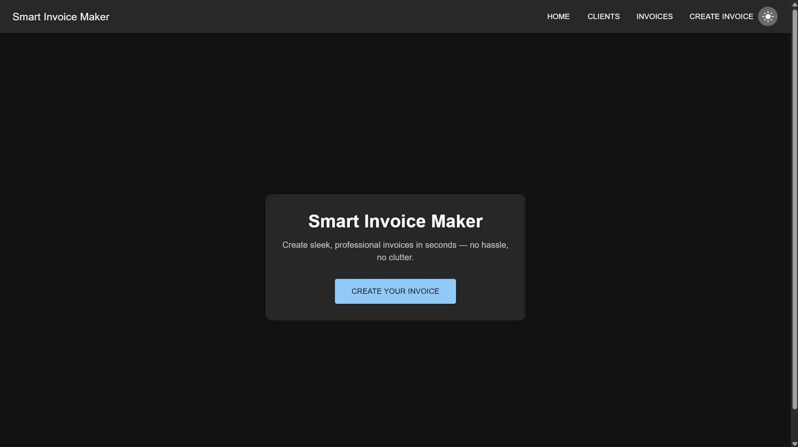

### 👥 Client Management

- **Add New Client**  
  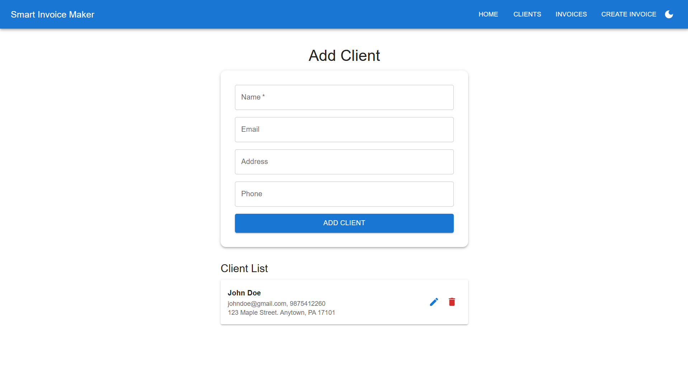

### 🧾 Invoice Creation Flow

- **Invoice Details**  
  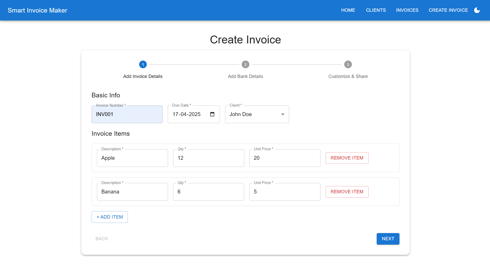
- **UPI Field Example**  
  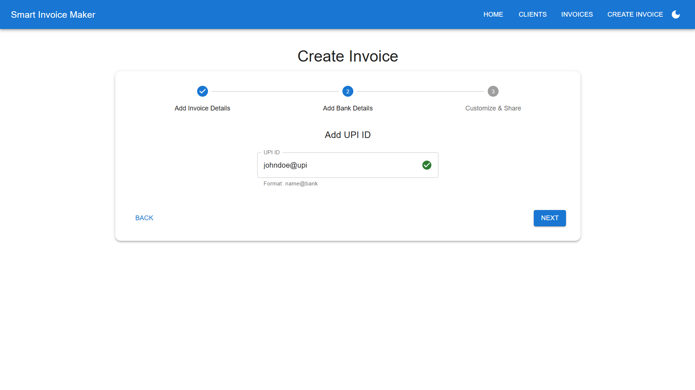
- **Preview Before Save**  
  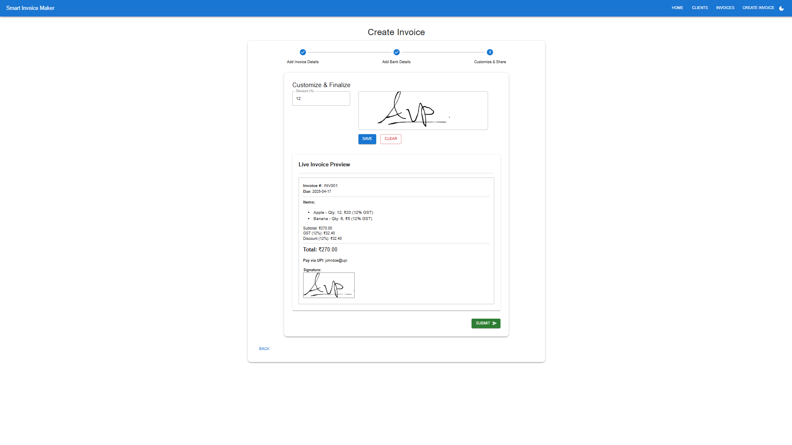
- **Invoice Creation Success**  
  

### 📋 Invoice Lists

- **Unpaid Invoices**  
  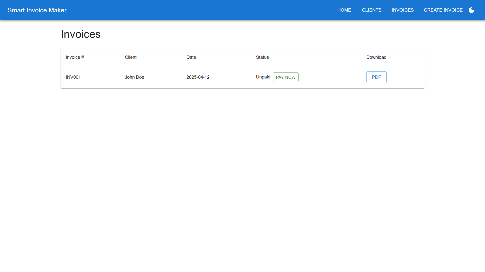
- **Paid Invoices**  
  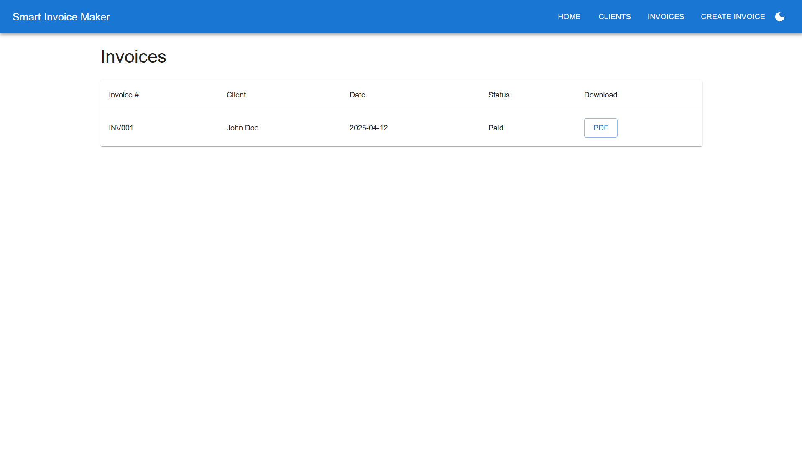

### 💳 Payment Integration (Razorpay)

- **Payment Step 1**  
  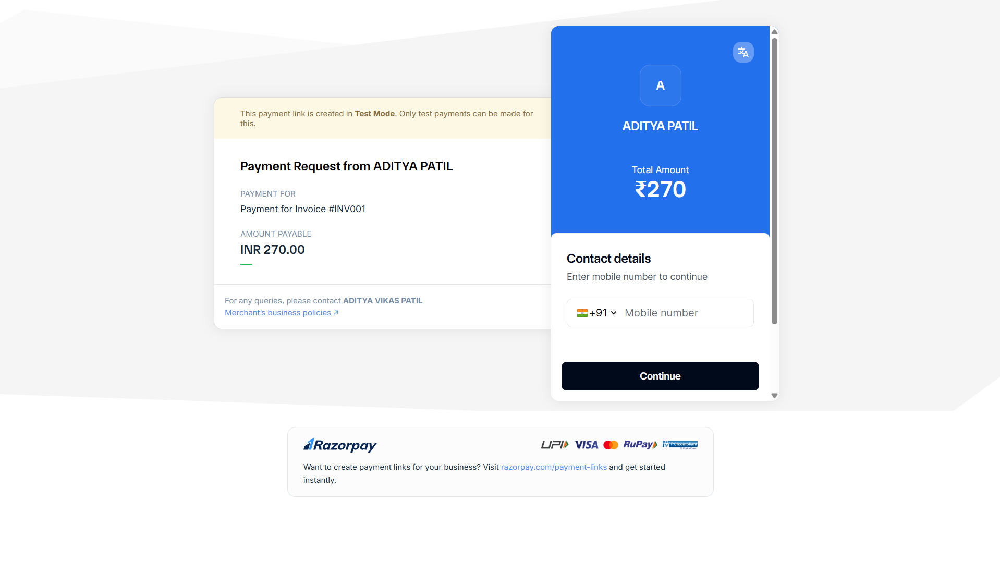
- **Payment Step 2**  
  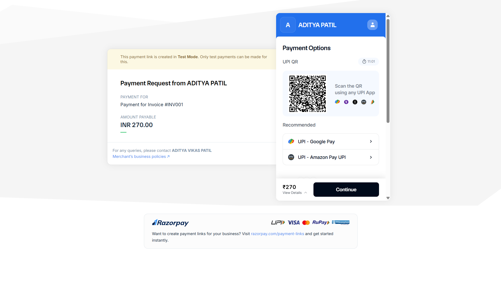
- **Payment Step 3**  
  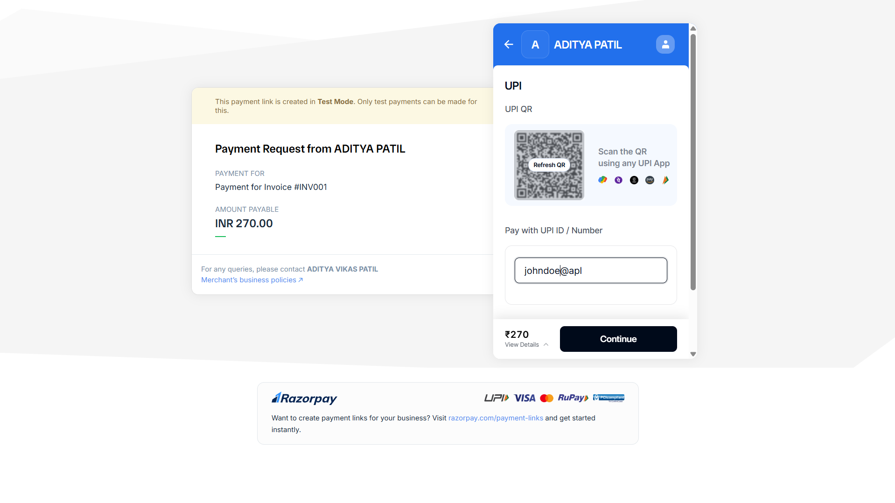
- **Payment Step 4**  
  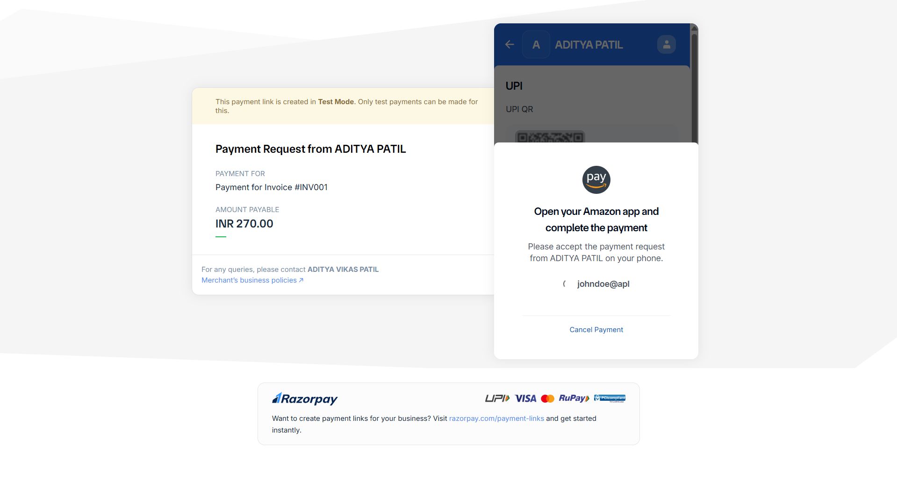
- **Payment Step 5**  
  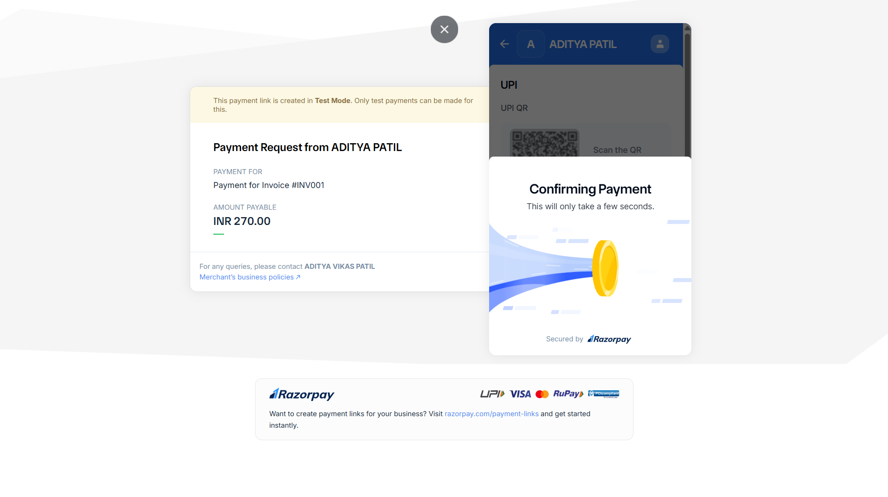
- **Payment Step 6**  
  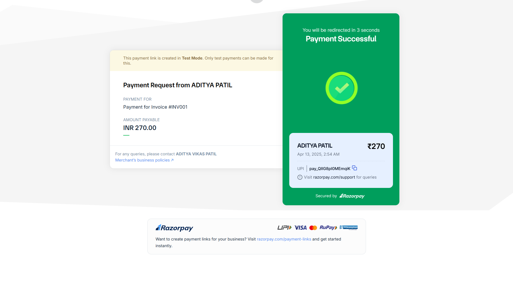

### 📄 PDF Export

- **Invoice PDF (INV001)**  
  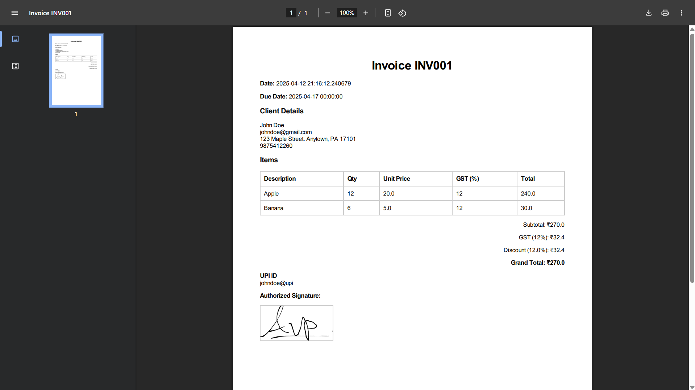

---

## API Endpoints

> For a full list of endpoints, refer to the `routes/` folder in the backend or use a tool like Postman to explore them.

---

## License

This project is licensed under the **MIT License**.
